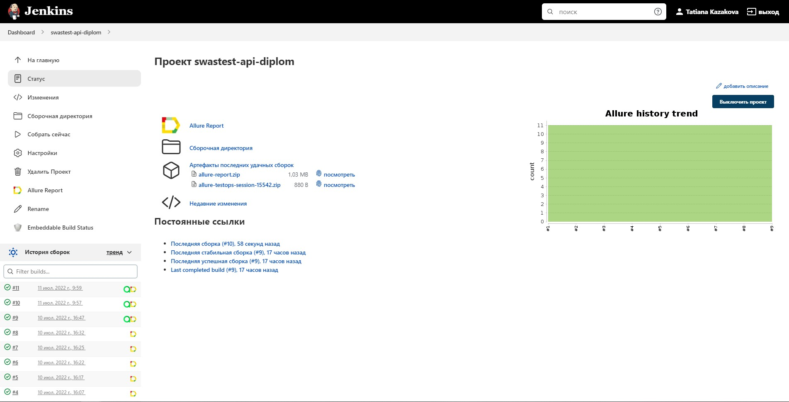
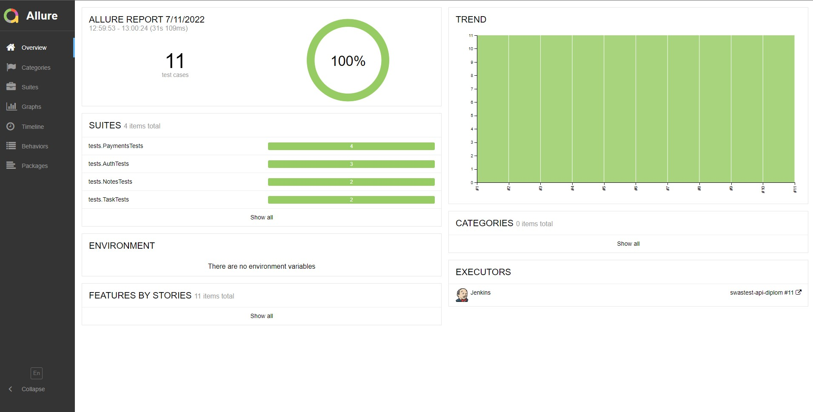
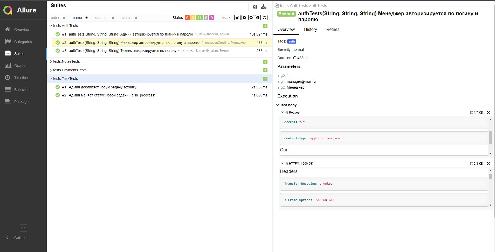
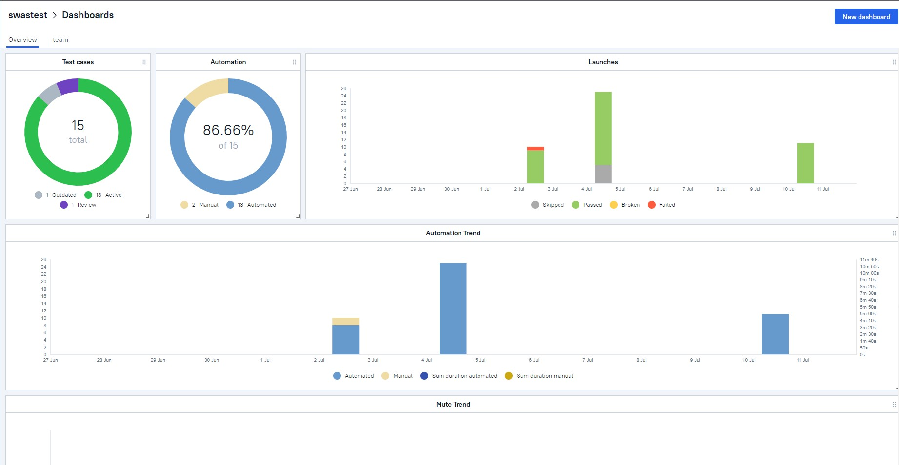
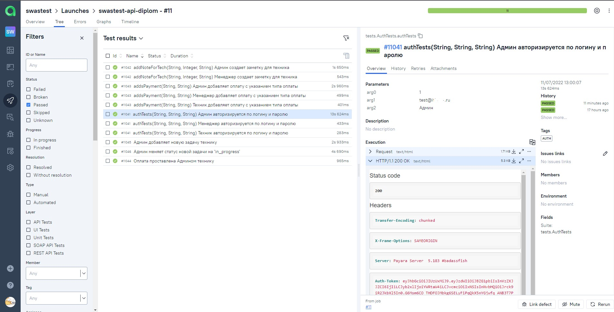
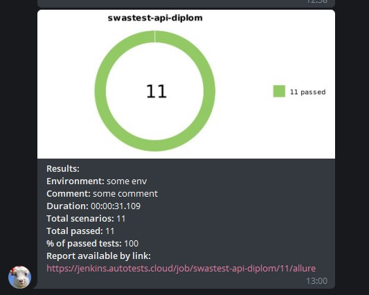

# Проект по автоматизации тестирования API мобильного приложения по распределению заказов технических работ
<p align="center">

</p>

#####  В данном приложении реализованы три основные роли -  все они задействованы в автотестах через подход  ParameterizedTest
 - Роль Администратора
  - Роль Менеджера
  - Роль Техника
***
## :floppy_disk: Содержание:
- <a href="#computer-технологии-и-инструменты">Технологии и инструменты</a>
- <a href="#notebook_with_decorative_cover-реализованные-проверки">Реализованные проверки</a>
- <a href="#electric_plug-сборка-в-Jenkins">Сборка в Jenkins</a>
- <a href="#arrow_forward-запуск-из-терминала">Запуск из терминала</a>
- <a href="#open_book-allure-отчет">Allure отчет</a>
- <a href="#hammer-allure-test-ops-отчет">Allure Test Ops отчет</a>
- <a href="#robot-отчет-в-telegram">Отчет в Telegram</a>

***
## :computer: Технологии и инструменты
<p align="center">


</p>

***

## :notebook_with_decorative_cover: Реализованные проверки
  - Проверки авторизации 
  - Проверки создания заметок
  - Проверки отметок оплаты
  - Проверки назначения нового задания и корректировка статусов заданий
***

## :electric_plug: Сборка в Jenkins
### <a target="_blank" href="https://jenkins.autotests.cloud/job/swastest-api-diplom/">Сборка в Jenkins</a>
<p align="center">

</p>


***

## :arrow_forward: Запуск из терминала

```
gradle clean test
```

*Такой вариант актуален как для локального запуска, так и для удаленного - выполнятся абсалютно все проверки.*

*А для большего удобства (например, если нам не нужно запускать все тесты проекта сразу), можно воспользоваться командами для запуска только тех тестов, которые затрагивают нужную часть кода*
```
gradle clean auth  - для проверок авторизации
gradle clean payment - запустятся тесты связанные с оплатами
gradle clean note - увидим, как побегут тесты для заметок
gradle clean task - будут произведены проверки связанные с отметками об оплатах
```

***

## :open_book: Allure отчет
- ### Главный экран отчета
<p align="center">

</p>

- ### Страница с проведенными тестами, где справа можно увидеть подробные аттачи с запросом и ответом + тестовые данные
<p align="center">

</p>


***

## :hammer: Allure Test Ops отчет
<p align="center">

</p>

- ### Страница с проведенными тестами и их результаты 
<p align="center">

</p>


***

## :robot: Отчет в Telegram
<p align="center">

</p>


:heart: 
:blue_heart:
